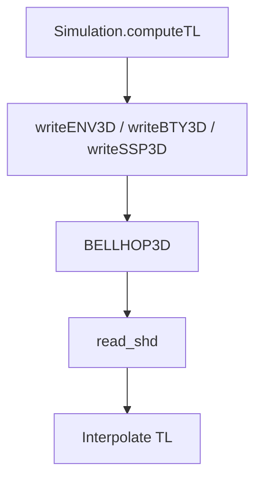

# UnderwaterModeling3D – API Reference  
*(package version 0.3)*

---
## Package Overview
| Namespace | Purpose |
|-----------|---------|
| **`uw`** | Public façade & parameter classes |
| **`uw.internal`** | Writers, forward model, scenario, visualisation |

---
## 1  `uw.Simulation` – façade
Owns **parameters**, **settings**, **scene** and exposes the main API.

### Constructor
```matlab
sim = uw.Simulation();                     % all defaults
sim = uw.Simulation(params);               % custom parameters
sim = uw.Simulation(params, sceneStruct);  % custom bathymetry
```
`sceneStruct` fields: `X` (km), `Y` (km), `floor` (depth grid in metres).

`params` as `uw.SimulationParameters` that can be constructed starting from a Map.

### Methods
| Method | Description |
|--------|-------------|
| `computeTL(pos)` | Transmission-loss at receiver positions `pos [N×3]` (x [km], y [km], z [m]). |
| `run(pos)` | Alias for `computeTL` (legacy). |
| `visualizeEnvironment()` | Plot SSP (or ENV) and a TL slice. |
| *planned* `visualizeRays()` | 3-D ray tracing (road-map v0.4). |

### Minimal Example
```matlab
params = uw.SimulationParameters.default();
sim    = uw.Simulation(params);
pos    = [0.5 0 20; 1 0 20];   % two receivers (km km m)
TL     = sim.computeTL(pos);
sim.visualizeEnvironment();
```

---
## 2  `uw.SimulationParameters`
Wrapper around a `containers.Map` storing *physical parameters*.

Create defaults:
```matlab
p = uw.SimulationParameters.default();
p.set('sound_speed_water', 1490);   % customise
```
Key API
| Method | Effect |
|--------|--------|
| `set(key,val)` / `get(key)` | Modify / read single parameter |
| `update(values,names)` | Batch update (aligned arrays) |
| `asArray(names)` | Convert subset to numeric vector |

---
## 3  `uw.SimSettings`
Static container for scalar simulation settings (frequency, grids etc.). Normally accessed indirectly via `uw.Simulation`, but you can:
```matlab
s = uw.SimSettings.default();
s.sim_frequency = 2000;   % customise
```

---
## 4  Internal Helpers (unstable API)
| Helper | Role |
|--------|------|
| `uw.internal.ForwardModel.computeTL(simOrMap,pos)` | Thin wrapper around BELLHOP3D |
| `uw.internal.writers.writeENV3D / writeBTY3D / writeSSP3D` | Emit input files |
| `uw.internal.Visualization.drawEnvironment` | Shared plotting logic |

---
## 5  Gaussian-Process SSP Modelling *(experimental)*
`uw.gp_modeling.SSPGaussianProcess` generates 3-D GP realisations:
```matlab
gp   = uw.gp_modeling.SSPGaussianProcess('lengthScale',500);
ssp  = gp.sampleField();          % Ny×Nx×Nz array
params.set('ssp_grid', ssp);      % `.ssp` automatically written
```
Full Bayesian inversion demo planned for v0.4.

---
## 6  Parameter-Estimation Utilities
Located in `src/filtering` (to be namespaced). Key functions:
| Function | Purpose |
|----------|---------|
| `step_ukf_filter()` | UKF prediction + update step |
| `ukf()` | Full UKF cycle |
| `unscented_transform()` | Core UT computation |

Example forward-model handle inside UKF:
```matlab
fx = @(theta) sim.computeTL(theta2pos(theta));
```

---
## 7  Sensor-Placement (NBV)
Entry point: `pos_next_measurement_sota(data,s)` – multi-algorithm selector.
Algorithms: `rrt_star_nbv`, `information_gain`, `multi_objective`, `tree_memoized`.

---
## 8  Utility Functions
| Utility | Description |
|---------|-------------|
| `startup()` | Add paths, verify BELLHOP |
| `clean_files(pattern)` | Remove temporary BELLHOP files |

---
## 9  Internal Flow Diagram


---
## 10  Deprecated Symbols
All standalone functions in `src/` are kept for research reproducibility but will be removed in the next major release. Use the namespaced API instead.

---
*Generated April 2024 – UnderwaterModeling3D team.*
