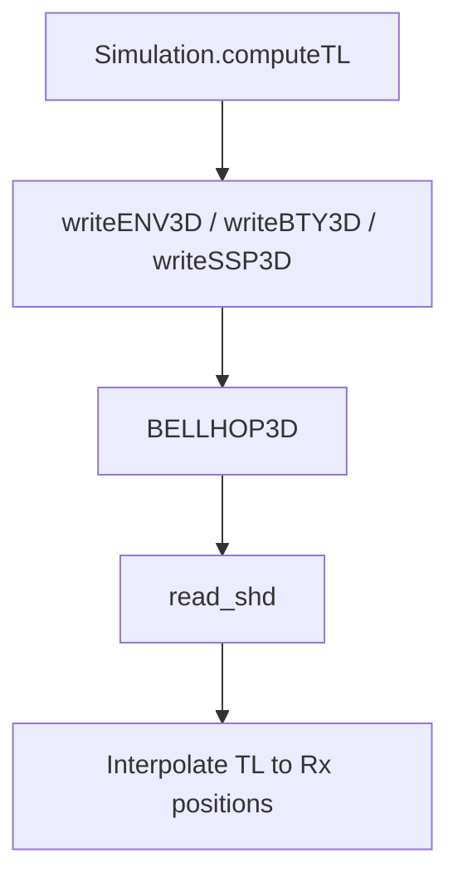

# UnderwaterModeling3D – API Reference  
*(package version 0.3)*

---
## Package Overview
| Namespace | Purpose |
|-----------|---------|
| **`uw`** | Public interface & parameter classes |
| **`uw.internal`** | Writers, forward model, scenario, visualisation |

---
## 1  `uw.Simulation` – main interface
Owns **parameters**, **settings**, **scene** and exposes the main API.
Units: x/y default to km (configurable via `sim.units`), depth in m.

### Constructor
```matlab
sim = uw.Simulation();                     % all defaults
sim = uw.Simulation(params);               % custom parameters
sim = uw.Simulation(params, sceneStruct);  % custom bathymetry
```
`sceneStruct` fields: `X` (km), `Y` (km), `floor` (depth grid in metres).

`params` as `uw.SimulationParameters` that can be constructed starting from a Map.

### Methods
| Method | Description |
|--------|-------------|
| `computeTL(pos)` | Transmission loss at receiver positions `pos [N×3]` (x [km], y [km], z [m]). |
| `computeTLWithNoise(pos[,sigma])` | TL with additive Gaussian noise (default `sigma` from settings). |
| `sampleSoundSpeed(pos)` | Interpolate SSP value (m/s) at `pos` (vectorized N×3).
| `plotTLSlice([bearingIdx])` | Plot a TL slice for a given bearing.
| `plotTLPolar()` | Polar TL plot around the source. |
| `plotEnvironment()` | Plot surface and seafloor meshes of the scene. |
| `writeBellhopInputFiles()` | Regenerate `.env/.bty/.ssp` for current state. |

### Minimal Example
```matlab
params = uw.SimulationParameters.default();
sim    = uw.Simulation(params);
pos    = [0.5 0 20; 1 0 20];   % two receivers (km km m)
TL     = sim.computeTL(pos);
sim.plotTLSlice();
```

---
## 2  `uw.SimulationParameters`
Wrapper around a `containers.Map` storing physical and geometric parameters.
Conventions: `source_x`,`source_y` in km; `source_depth` in m; `source_frequency` in Hz; `max_range_km` in km.

Create defaults:
```matlab
p = uw.SimulationParameters.default();
p.set('sound_speed_water', 1490);   % customise
```
Key API
| Method | Effect |
|--------|--------|
| `set(key,val)` / `get(key)` | Modify / read single parameter |
| `update(values,names)` | Batch update (aligned arrays) |
| `asArray(names)` | Convert subset to numeric vector |
| `getMap()` | Copy of underlying `containers.Map` |
| `hasParameter(name)` | Check existence |
| `compareWith(other[,names])` | Differences for selected parameters |

---
## 3  `uw.SimSettings`
Static container for scalar simulation settings (frequency, grids, file names, measurement options). Normally accessed indirectly via `uw.Simulation`, but you can:
```matlab
s = uw.SimSettings.default();
s.sim_frequency = 2000;   % customise
```

---
## 4  Internal Helpers (unstable API)
| Helper | Role |
|--------|------|
| `uw.internal.ForwardModel.computeTL(simOrMap,pos)` | Thin wrapper around BELLHOP3D |
| `uw.internal.writers.writeENV3D / writeBTY3D / writeSSP3D` | Emit input files |
| `uw.internal.Visualization.plotTLSlice / plotTLPolar / plotSSP` | Plotting helpers |

---
## 5  Internal Flow Diagram

---
*For any further question, reach out without esitation.*
