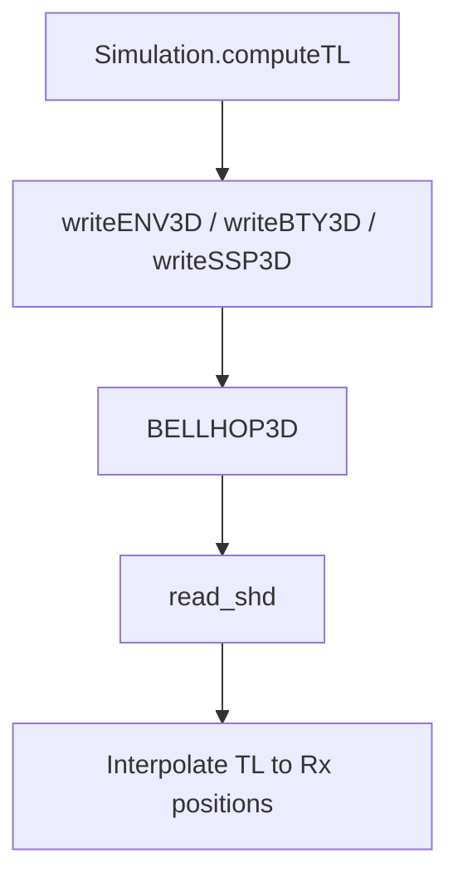

# UnderwaterModeling3D – API Reference  
*(package version 0.3)*

---
## Package Overview
| Namespace | Purpose |
|-----------|---------|
| **`uw`** | Public interface & parameter classes |
| **`uw.internal`** | Writers, forward model, scenario, visualisation |

---
## 1  `uw.Simulation` – main interface
Owns **parameters**, **settings**, **scene** and exposes the main API.
Units: x/y default to km (configurable via `sim.units`), depth in m.

### Constructor
```matlab
sim = uw.Simulation();                     % all defaults
sim = uw.Simulation(params);               % custom parameters
sim = uw.Simulation(params, sceneStruct);  % custom bathymetry
```
`sceneStruct` fields: `X` (km), `Y` (km), `floor` (depth grid in metres).

`params` as `uw.SimulationParameters` that can be constructed starting from a Map.

### Methods
| Method | Description |
|--------|-------------|
<z| `computeTL([pos])` | Transmission loss at positions. If omitted, computes at primary sensor; pass `"all"` to compute at all sensors; or pass `pos [N×3]` (x [km], y [km], z [m]). |
| `computeTLWithNoise([pos][, sigma])` | TL with additive Gaussian noise. Same position rules as `computeTL`; `sigma` defaults to settings. |
| `sampleSoundSpeed([pos])` | Interpolate SSP value (m/s). Same position rules as `computeTL`. |
| `plotTLSlice([bearingIdx])` | Plot a TL slice for a given bearing.
| `plotTLPolar()` | Polar TL plot around the source. |
| `plotEnvironment()` | Plot surface and seafloor meshes of the scene. |
| `writeBellhopInputFiles()` | Regenerate `.env/.bty/.ssp` for current state. |

Small examples:
```matlab
sim.computeTL();           % at primary sensor
sim.computeTL("all");     % at all sensors
sim.sampleSoundSpeed();    % SSP at primary sensor
sim.computeTL([1 0 20]);   % explicit position
sim.computeTLWithNoise([], 2.0);  % primary sensor with sigma=2 dB
```

### Minimal Example
```matlab
params = uw.SimulationParameters.default();
sim    = uw.Simulation(params);
pos    = [0.5 0 20; 1 0 20];   % two receivers (km km m)
TL     = sim.computeTL(pos);
sim.plotTLSlice();
```

---
## 2  `uw.SimulationParameters`
Wrapper around a `containers.Map` storing physical and geometric parameters.
Conventions: `source_x`,`source_y` in km; `source_depth` in m; `source_frequency` in Hz; `max_range_km` in km.

Create defaults:
```matlab
p = uw.SimulationParameters.default();
p.set('sound_speed_water', 1490);   % customise
```
Key API
| Method | Effect |
|--------|--------|
| `set(key,val)` / `get(key)` | Modify / read single parameter |
| `update(values,names)` | Batch update (aligned arrays) |
| `asArray(names)` | Convert subset to numeric vector |
| `getMap()` | Copy of underlying `containers.Map` |
| `hasParameter(name)` | Check existence |
| `compareWith(other[,names])` | Differences for selected parameters |

---
## 3  `uw.Sensor` – movable agents and IPP
Represents a sensor/agent with position tracking and motion strategies. Created automatically by `uw.Simulation` or manually.
You can configure a strategy once via `setStrategy(...)` and execute a step each iteration with `step(...)`.

### Constructor
```matlab
sensor = uw.Sensor();                          % defaults at origin
sensor = uw.Sensor('auv', [1 0 20], settings); % role, start position, bounds
```

### Properties
| Property | Description |
|----------|-------------|
| `pos` | Current position `[x y z]` |
| `path` | History of positions (N×3 matrix) |
| `bounds` | Movement constraints from `SimSettings` |
| `sim` | Back-reference to parent simulation |

### Movement Methods
| Method | Description |
|--------|-------------|
| `move([x y z])` | Move to absolute position |
| `move(@plannerFn)` | Move using custom function handle |
| `lawnmower()` | Rectangular scanning pattern |
| `treeSearch("depth", N, state)` | Tree-based IPP planning with configurable depth |
| `rrtStar("max_iter", N, state)` | RRT* exploration planning with tunable parameters |
| `randomInfoGain("n_candidates", N, state)` | Random sampling IPP with candidate control |
| `setStrategy(name, varargin)` | Store a strategy and its name–value parameters |
| `step([state])` | Execute stored strategy once (optionally passing estimation state) |
| `stepFromSettings([state])` | Execute a step using `sim.settings.ipp_method` (convenience) |

### Usage Examples
```matlab
% Basic movement
sim = uw.Simulation();
sim.sensor.move([1.5 0.2 25]);
sim.sensor.lawnmower();

% Custom movement via function handle
sim.sensor.move(@(sensor) [sensor.pos(1)+0.1, sensor.pos(2), sensor.pos(3)]);

% IPP with estimation
% Prepare estimation state once
estimationState = struct( ...
    'sim_est', mySimulationEstimate, ...
    'th_est', myParameterEstimate, ...
    'Sigma_est', myCovarianceMatrix, ...
    'Sigma_rr', myMeasurementNoise);

% Use IPP strategies with estimation and custom parameters
sim.sensor.treeSearch("depth", 2, estimationState);
sim.sensor.rrtStar("max_iter", 50, "step_size", 0.8, estimationState);
sim.sensor.randomInfoGain("n_candidates", 25, "search_radius", 4, estimationState);

% Custom strategy
sim.sensor.move(@(sensor) myCustomPlanner(sensor));

% Configure strategy once, then step each iteration
sim.sensor.setStrategy("treeSearch", "depth", 2);
sim.sensor.step(estimationState);

% Multiple sensors
auv = uw.Sensor('auv', [0 0 10], sim.settings);
sim.addSensor(auv);
auv.setStrategy("rrtStar", "max_iter", 25, "step_size", 0.8);
auv.step(estimationState);
```

### Adding Custom Strategies
Extend by adding methods to the `Sensor` class:
```matlab
function next = spiralPattern(obj, opts)
    angle = size(obj.path,1) * opts.angleStep;
    radius = opts.radius;
    next = [radius*cos(angle), radius*sin(angle), obj.pos(3)];
    obj.pos = next;
    obj.path(end+1, :) = next;
end
```

Then use: `sim.sensor.spiralPattern(struct('turns', 3));`

### IPP Parameter Reference
| Strategy | Available Options | Description |
|----------|-------------------|-------------|
| `treeSearch` | `depth` | Tree search depth (default: 1) |
| `rrtStar` | `max_iter` | Maximum RRT iterations (default: 15) |
| | `step_size` | RRT step size (default: 1.0) |
| | `goal_bias` | Bias toward goal (default: 0.05) |
| | `search_radius` | Node connection radius (default: 8.0) |
| `randomInfoGain` | `n_candidates` | Number of candidate positions (default: 10) |
| | `search_radius` | Search radius in steps (default: 3) |

---
## 4  `uw.SimSettings`
Static container for scalar simulation settings (frequency, grids, file names, measurement options). Normally accessed indirectly via `uw.Simulation`, but you can:
```matlab
s = uw.SimSettings.default();
s.sim_frequency = 2000;   % customise
```

---
## 5  Internal Helpers (unstable API)
| Helper | Role |
|--------|------|
| `uw.internal.ForwardModel.computeTL(simOrMap,pos)` | Thin wrapper around BELLHOP3D |
| `uw.internal.writers.writeENV3D / writeBTY3D / writeSSP3D` | Emit input files |
| `uw.internal.Visualization.plotTLSlice / plotTLPolar / plotSSP` | Plotting helpers |

---
## 6  Internal Flow Diagram

---
*For any further question, reach out without esitation.*
